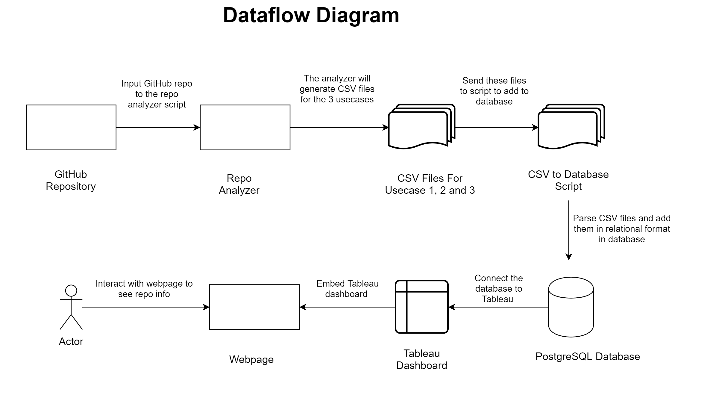
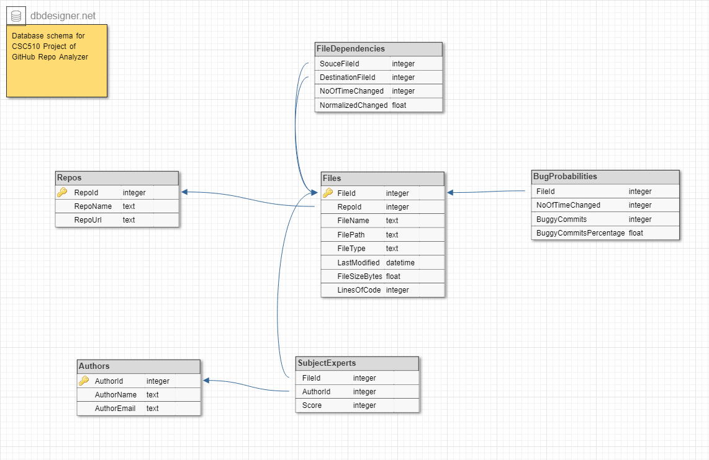
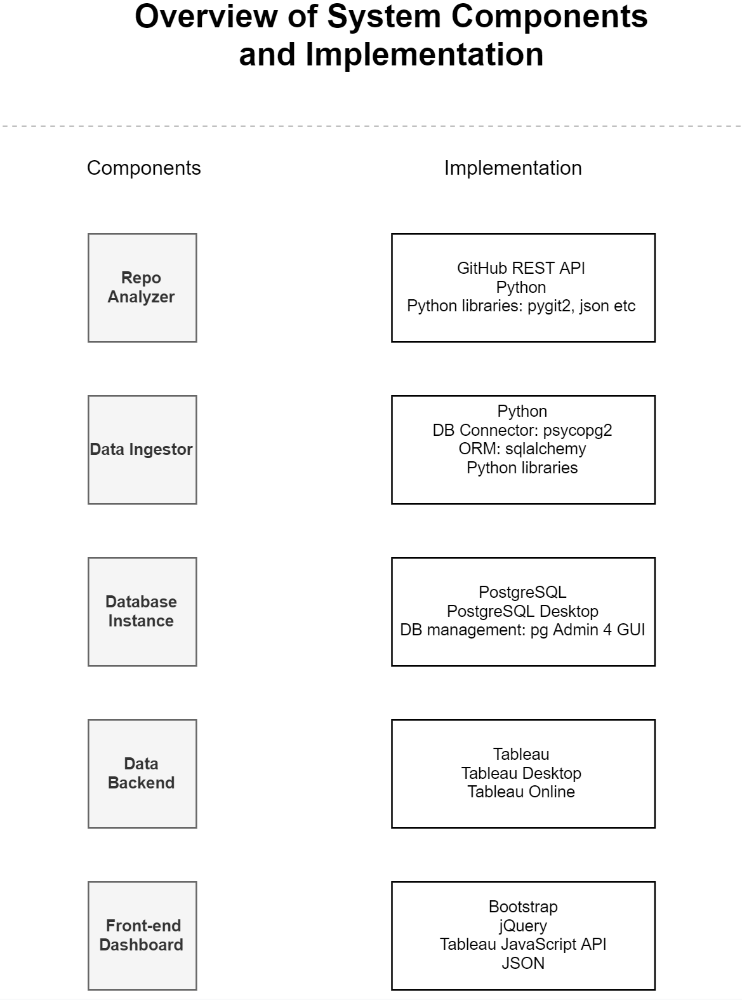

# Milestone 2 : CSC510 Project : Team 12

## [WORKSHEET.md](https://github.ncsu.edu/dpdodiya/csc510-project/blob/master/WORKSHEET.md)

## Screen cast: https://www.youtube.com/watch?v=fVnPIaAr9y0

## Demo: http://csc510.000webhostapp.com/

# Use cases

## Use case 1 : Displaying subject matter expert

### Pre-conditions

1.  The project selected needs to be hosted in GitHub as a public repo and need to have enough git history to analyze to be useful in scoring mechanism.
    
2.  The project selected needs to be a software development project.
    

### Main flow

1.  User selects a repository from the available list. [S1]

2.  User selects a particular file of interest to get list of top contributors.[S2]

3.  Portal will display the information and analysis for selected file.[S3]    

### Sub flows

[S1]: The list of available repositories for analysis will be pre-populated.

[S2]: Portal will display a tableau dashboard consisting of three sheets embedded in the web page.

[S3]: In "Developer Expertise on File" sheet, tableau graph will show the contribution of every user in the form of blocks where the size of block will represent the contribution of users for selected file.  

[S4]: On hovering over specific block, the contact information will be displayed consisting of the email ID and name of the contributor. 

  

## Use case 2 : Displaying possible file dependency

### Pre-conditions
1.  The project selected needs to be hosted in GitHub as a public repo and need to have enough git history to analyze to be useful in scoring mechanism.
    
2.  The project selected needs to be a software development project.  
     
### Main flow

1.  User selects a repository from the available list. [S1]
        
2.  User selects a particular file of interest to get list of files which are most likely to be modified together.[S2]

3.	Portal will display the results for selected file.[S3]   

### Sub flows

[S1]: The list of available repositories for analysis will be pre-populated.

[S2]: Portal will display a tableau dashboard consisting of three sheets embedded in the web page.

[S3]: In "Possible File Dependency" sheet, the tableau graph will show the number of times and percentage of time dependent files are changed. The ring in graph represents each file.

[S4]: On hovering over specific ring, information will be displayed consisting of dependent file name, number of times and percentage of times files were changed together. 

## Use case 3 : Showing probable bugginess of a files

### Pre-conditions
1.  The project selected needs to be hosted in GitHub as a public repo and need to have enough git history to analyze to be useful in scoring mechanism.
    
2.  The project selected needs to be a software development project.  
      
### Main flow

1.  User selects a repository from the available list. [S1]
 
2.  User selects a particular file of interest to get an idea about how bug prone the files or sees the files which has the highest percentages of bugs in project history.[S2]

3.	Portal will display the results for selected file.[S3]
    
    
### Sub flows 
    
[S1]: The list of available repositories for analysis will be pre-populated.

[S2]: Portal will display a tableau dashboard consisting of three sheets embedded in the web page.

[S3]: In "Bugginess" sheet, tableau list will show the file names and some information of files.

[S4]: On hovering over file information, file name, number and percentage of buggy commits and number of times file is changed will be displayed.

**NOTE:** The user-cases mentioned above are consistent with the ones provided in DESIGN.md and we are going to keep them the same throughout the project. However, we changed the design of the portal to the one we are proposing in this milestone and that will also remain consistent from this point onwards.

# Data representation 

## Data flow diagram 
Below is the updated data flow diagram for the application. 

The flow will start from analyzing GitHub repository and end with user exploring analyzed repository information. 

The raw data is converted to intermediary CSV format. The CSV files later get injected to the PostgreSQL database. 

The data formats of above representations are described below. 

## CSV data definition 
The repo analyzer tool outputs 3 CSV files after repo analysis. 

Each CSV file corresponds to a single use case. For instance, 

### Use case 1 CSV
Example CSV: https://github.ncsu.edu/dpdodiya/csc510-project/blob/master/usecases/uc1v2.csv

|Attribute|Description|Value|
|--|--|--|
|RepoName|Name of the repository|csc510-project|
|RepoUrl|URL of the repository|https://github.ncsu.edu/dpdodiya/csc510-project|
|FilePath|Path of the file|database/Database_Schema_Design.png|
|LastModified|Last modification done |1551927228187|
|FileSizeBytes|Size of file in Bytes|11111|
|LinesOfCode|Lines of code in the file|11|
|AuthorName|Name of contributor of file|Darpan Dodiya|
|AuthorEmail|Email of contributor of file|dpdodiya@ncsu.edu|
|Score|Contribution score|30|
 
Score = ΣLOC * [((ti - to)/(tL-ti))/(tL - to)]  
where LOC = Number of lines added by the developer  
      ti = Time stamp of current commit  
      to = Time stamp of oldest commit  
      tL = Time stamp of lastest commit  

### Use case 2 CSV
Example CSV: https://github.ncsu.edu/dpdodiya/csc510-project/blob/master/usecases/uc2v2.csv

|Attribute|Description|Value|
|--|--|--|
|RepoName|Name of the repository|csc510-project|
|RepoUrl|URL of the repository|https://github.ncsu.edu/dpdodiya/csc510-project|
|SourceFilePath|Path of the file|DESIGN.md|
|DestinationFilePath|Path of the related/dependent file|database/Database_Schema_Design.png|
|NoOfTimeChanged|Number of times both files were changed together|30|
|NormalizedChange|Normalized value of times both files were changed together|0.666|

### Use case 3 CSV
Example CSV: https://github.ncsu.edu/dpdodiya/csc510-project/blob/master/usecases/uc3v2.csv

|Attribute|Description|Value|
|--|--|--|
|RepoName|Name of the repository|csc510-project|
|RepoUrl|URL of the repository|https://github.ncsu.edu/dpdodiya/csc510-project|
|SourceFilePath|Path of the file|README.md|
|NoOfTimeChanged|Number of times file was changed|30|
|BuggyCommits|Number of buggy commits|15|
|BuggyCommitsPercentage|Percentage value of number of buggy commits|0.5|

A script consumes above CSV files, parses them and adds them to PostgreSQL database in relational format. 

The PostgreSQL database instance is described below. 

## Database schema design
We are storing the repository data in relational database PostgreSQL. The rationale behind choosing relation data store has been explained in the section of implementation. 

The database schema is in normalized form (3NF). 

The database schema is as follows: 

### Table description
|  Table Name|Description  |Use Cases Covered|
|--|--|--|
| Repos |Stores repository information  |Usecase 1, Usecase 2, Usecase 3|
| Files |Stores files information  |Usecase 1, Usecase 2, Usecase 3|
| SubjectExperts |Stores experts/author's Id and score information  |Usecase 1|
| Authors |Stores author's information(name, email)  |Usecase 1|
| FileDependencies |Stores dependency information of related files |Usecase 2|
| BugProbabilities |Stores buggy commits information of files  |Usecase 3|

### Field description
All the fields in the database co-relate to the fields in the CSV file. Please refer to the documentation of CSV fields above for more information.

# Data Mocking 

We decided to use a mocking strategy that closely aligns with the real data that we'd use. 

## Preparation
The database schema was designed first considering all use cases. 

To ingest data into the database, we decided to use intermediate CSV file representation that conforms to the database schema. 

## First stage
In order to make sure that we were able to ingest data into the database from CSV files, we manually mocked data of 4 records. This was done just to make sure that our approach of ingesting CSV to database works well. 

An example CSV file of the mocked data can be seen here: https://github.ncsu.edu/dpdodiya/csc510-project/blob/master/usecases/uc1v2.csv

This mock data was used to verify integration of CSV - PostegreSQL - Tableau. 

After we had a proof of concept that the approach worked well, we decided to use a mock data that closely resembles with the actual data. 

## Second stage
Instead of generating CSV with random mock data, a Python script was written which would actually crawl, parse and analyze a GitHub repository and output CSV with real analyzed data. 

While the generated data might not have been accurate, it still closely resembled to the actual data that we'd want to use. (e.g. For use case 1, the *Score* attribute might need to normalized for best use, but the value of *Score* was real nevertheless.)

## Summary
Our strategy started with verifying integration of different components with manually generated mock data. After the verification, we chose an automated approach which would actually analyze the repository and generate real data for subsequent usage. 

The data flow diagram described above might be a useful reference to understand the data path.  

# Portal Implementation Details

The portal has been implemented by integrating several components. 

The rationale behind technology/architecture decisions, library/tools usage has been explained separately in the section of each component. 

The overview of the system component and their implementation has been given in below diagram. 

## Overview of system components and implementation

## Repo Analyzer 
### Introduction
This component analyzes a given GitHub repository to find relevant data for all use cases. 

### Input
GitHub Repo URL

### Output
CSV files for each use case. 

### Implementation
Since this component would involve,
	 - Accessing GitHub APIs
	 - Downloading repo
	 - Crawling files 
	 - Analyzing commits
	 - Producing CSV files

We decided to use Python as primary language platform. Compared to other languages, Python has comprehensive and well documented libraries to perform tasks outlined above. 

### Codebase
Relevant code and documentation can be found at: https://github.ncsu.edu/dpdodiya/csc510-project/tree/master/code_base/git_access

### Libraries and tools
Several libraries and tools were used to make the development process efficient. Some of the important ones are:

#### pygit2
Pygit2 is a set of Python bindings to the libgit2 shared library, libgit2 implements the core of Git.

To clone and analyze a Git repo. 

#### GitHub REST API
Official GitHub API to interact with repository hosted on GitHub platform.

#### pandas, numpy
Data analysis tools for Python. 

## Data Ingestor
### Introduction
This component ingests data generated by the repo analyzer tool to the database. 

### Input
CSV files

### Output
Data inserted into PostgreSQL database

### Implementation
Since the previous component was based on Python language, it would make most sense to continue developing tools on the same platform for consistency. So we decided to implement this component using Python. 

Parsing data from CSV files was implemented using csv library. 

An ORM library, sqlalchemy was used to map and insert the data into the PostgreSQL database instance. Since our data was relational and one record was needed to be inserted in multiple tables, this helped a lot. 

### Codebase
Relevant code and documentation can be found at: https://github.ncsu.edu/dpdodiya/csc510-project/tree/master/database/data_converter

### Libraries and tools
Several libraries and tools were used to make the development process efficient. Some of the important ones are:

#### sqlalchemy
SQLAlchemy is the Python SQL toolkit and Object Relational Mapper that gives application developers the full power and flexibility of SQL.

#### csv
To parse CSV file data. 

## Database instance
### Introduction
This component is central to the entire system. It stores data for all use cases.    

### Input
Analyzed data

### Output
Data stored in relational format

### Implementation
Since this was a critical component of the system, the decision for this was made carefully. 

#### SQL vs NoSQL
We outlined all possible attributes and data that we would need for our application. 

After outlining the attributes, it was apparent to us that they had relation with each other. Each attribute was connected with some other attribute, and we were able to find link. 

Relational database would work best for us in that case, so we decided to go ahead with SQL database. 

#### PostgreSQL
PostgreSQL is an open source and very popular SQL database. 

We also found that it is very well integrated with Tableau, has simple to use Python library and has extensive management dashboard GUI. 

Thus, we decided to move ahead with PostgreSQL instance. A local instance was installed. 

The schema was designed in https://www.dbdesigner.net/ tool. The tool has auto-generated SQL which we were able to import in local instance. 

The query can be found at: https://github.ncsu.edu/dpdodiya/csc510-project/blob/master/database/create_database_postgres.sql 

### Codebase
Relevant code and documentation can be found at: https://github.ncsu.edu/dpdodiya/csc510-project/tree/master/database

### Libraries and tools
Several libraries and tools were used to make the development process efficient. Some of the important ones are:

#### PostgreSQL Desktop
For local server instance of PostgreSQL

#### DB Designer
For schema design

#### pg Admin 4 GUI
Web based GUI to manage local installation of PostgreSQL

## Data back-end
### Introduction
This component is instrumental in filtering, visualization and presentation of the data. 

### Input
Data source

### Output
Data visualization 

### Implementation
There were two options for this component, 

Tableau and Qlik. 

We compared both solutions in terms of:

 - Local desktop client
 - External APIs
 - Web publishing platform

Tableau found to be a better solution overall, especially due to its local desktop client functionality so we made a decision to host our portal on Tableau. 

A local installation was created and data was imported. Once data source was available, views were created for use case and were published to Tableau Online. 

### Codebase
None

### Libraries and tools
Several libraries and tools were used to make the development process efficient. Some of the important ones are:

#### Tableau Desktop
For local instance of Tableau.

#### Tableau Online
To publish views, workbooks and data sources online.

## Front-end dashboard
### Introduction
User interacts with this dashboard to visualize information of a given repository. 

### Input
Data source from Tableau APIs

### Output
Interactive and navigable web page 

### Implementation
Although Tableau has excellent visualization tools, we found that user navigation for our use cases wasn't great. 

We figured that to improve user experience, we could develop custom front-end dashboard and embed Tableau data/visualization from our dashboard. 

Tableau has JavaScript API available so we chose to develop front-end in simple HTML/CSS/JavaScript. 

A bootstrap template was used to build the dashboard. 

### Codebase
https://github.ncsu.edu/dpdodiya/csc510-project/tree/master/code_base/Webpage%20Integration

### Libraries and tools
Several libraries and tools were used to make the development process efficient. Some of the important ones are:

#### Bootstrap
Front-end component library to build components of dashboard

#### Tableau APIs
To embed views of Tableau dashboard to our page

#### jQuery
For user interaction and navigation

#### Live demo
A working demo of this component can be found at: http://csc510.000webhostapp.com/
