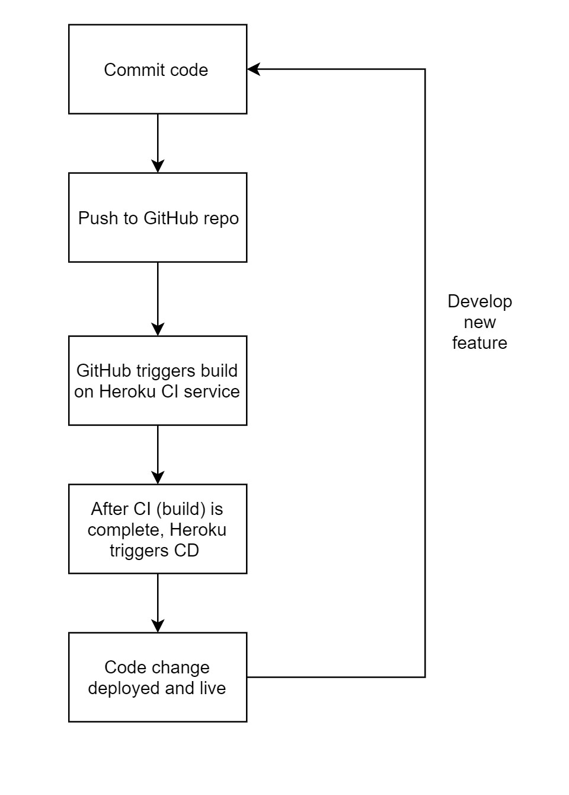
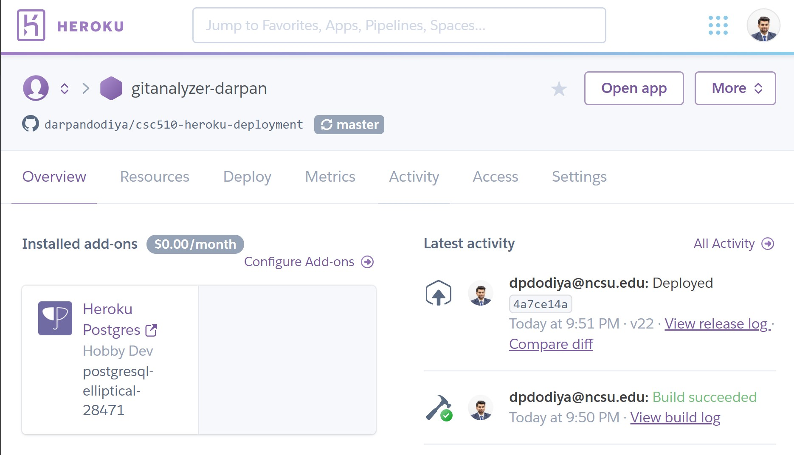

# Milestone 4 : CSC510 Project : Team 12

## [WORKSHEET.md](https://github.ncsu.edu/dpdodiya/csc510-project/blob/master/WORKSHEET.md#milestone-4)

## Screen cast: https://drive.google.com/file/d/1p1JCLb1fXAdDmh7gHnyZKKbWZPITpbam/view?usp=sharing

## Demo: [https://gitanalyzer-darpan.herokuapp.com/](https://gitanalyzer-darpan.herokuapp.com/) ##

Note: Heroku app has limited database size for free tier. If you're trying to mine a new repo then please mine a small repo. 

## Milestone 4 : Deployment

---

### Introduction
The application uses following tech stack:

|Component|Technology  |
|--|--|
|Web Server  |Flask Web Server |
|Core Services|Python|
|Data Store|PostgreSQL|
|Source Control|Git/GitHub|
|Hosting|Heroku|
|CI/CD|Flask Migrations, Heroku Depoys and GitHub Integration|
|Data Visualization|Tableau|

Since we're using Heroku to host our application, a lot of configuration management is already automated and provisioned by it. 

Current CI/CD process is fully automated and is visualized as: 

---

### Deployment

Note: Heroku [doesn't support](https://help.heroku.com/XLNLNW7Y/how-to-use-github-integration-with-github-enterprise) GitHub Enterprise version for automatic deployments so we are using a private repository on our personal GitHub account. This repo and personal account repo are in sync. The synced folder is: [https://github.ncsu.edu/dpdodiya/csc510-project/tree/master/GitAnalyzer/webapp](https://github.ncsu.edu/dpdodiya/csc510-project/tree/master/GitAnalyzer/webapp)

---
 
#### Heroku CI 
Heroku manages app CI/CD with Git. So Git and Heroku CLI should be installed in order to manage deployments. Steps to do so can be found at: [https://devcenter.heroku.com/articles/preparing-a-codebase-for-heroku-deployment](https://devcenter.heroku.com/articles/preparing-a-codebase-for-heroku-deployment)

##### Procfile
Heroku apps include a **Procfile** that specifies the commands that are executed by the app on startup. We are using the Procfile to:
-  Spin up app’s web server
- Perform database migration before a new release is deployed

Link to Procfile: [https://github.ncsu.edu/dpdodiya/csc510-project/blob/master/GitAnalyzer/webapp/Procfile](https://github.ncsu.edu/dpdodiya/csc510-project/blob/master/GitAnalyzer/webapp/Procfile)

    web: gunicorn app:app
    release: python manage.py db upgrade

Procfile will be run automatically whenever code is deployed to Heroku. 

##### requirements.txt
Heroku automatically identifies app as a Python app if requirements.txt file is present in its root directory. 

When you deploy to Heroku, the dependencies you specify in your requirements.txt file are automatically installed before app startup.

We have identified and added all dependencies in the file: [https://github.ncsu.edu/dpdodiya/csc510-project/blob/master/GitAnalyzer/webapp/requirements.txt](https://github.ncsu.edu/dpdodiya/csc510-project/blob/master/GitAnalyzer/webapp/requirements.txt)

    flask
    flask_sqlalchemy
    pygit2
    flask_script
    flask_migrate
    sqlalchemy
    alembic
    requests
    pandas
    flatten_dict
    pprint
    api
    numpy
    nltk
    networkx
    gunicorn
    psycopg2
    pycparser
    psycopg2-binaryr

##### Database Migration using flask-migration

Our application needs a database to save data. It uses the PostgreSQL database to persist this data. Heroku is intelligent enough to scan through our application code and assign it a Postgres database.

To populate the database with our tables. We do this via `Procfile` 

    release: python manage.py db upgrade

The command  `db upgrade`  from the  [`manage.py`](https://github.ncsu.edu/dpdodiya/csc510-project/blob/master/GitAnalyzer/webapp/manage.py)  file populates the table schema from the database  [migration](https://flask-migrate.readthedocs.io/en/latest/)  file into the database.

Migrations files used to populate tables can be found under: [https://github.ncsu.edu/dpdodiya/csc510-project/tree/master/GitAnalyzer/webapp/migrations](https://github.ncsu.edu/dpdodiya/csc510-project/tree/master/GitAnalyzer/webapp/migrations)

 ##### Independence

The Heroku CI process is independent of all environment factors. 

For instance, to access PostgreSQL instance, we use environment variable `os.environ['DATABASE_URL']` provided by Heroku. Thus, the application code works with any Heroku project instance. 

The requirements are also independent so the application can be started with any Heroku app. 

---

#### GitHub + Heroku CD
 
Applications can be deployed to Heroku platform from command line. However, to automate this we are using Automatic deploys feature of Heroku. Heroku has integration with GitHub. Through this integration, code diffs, manual and auto deploys are available for app hosted on GitHub repo.

This integration enables a chosen branch to be automatically deployed to specified Heroku app.

As noted earlier, GitHub Enterprise version doesn't work well with Heroku we have replicated deployment branch on personal GitHub account. The canonical branch in this repository is: [https://github.ncsu.edu/dpdodiya/csc510-project/tree/heroku-deploy](https://github.ncsu.edu/dpdodiya/csc510-project/tree/heroku-deploy)

The live integration can be seen working in below screenshot. After a commit was made on [darpandodiya/csc510-heroku-deployment](https://github.com/darpandodiya/csc510-heroku-deployment "View on GitHub") repo, a build was automatically triggered on Heroku and then it was automatically deployed too. 

---

#### Summary

To summarize the process, 

 1. Commit Procfile, requirements.txt, migration files and code on GitHub repo
 2. Connect GitHub to Heroku app via Heroku Dashboard
 3. Push code to GitHub and it will be deployed to Heroku
 4. Application is deployed and live

---

### Data Ingest/Update

Data ingestion and update was live in our earlier milestone too. We have refined the process to handle corner cases and remove hard-coded values. 

Now we do not store data representation in intermediate CSV files, but instead pass through pandas dataframe. 

We now access database via Heroku environment variable, `DATABASE_URL`, so this can work across all deployments. 

#### Problem with Tableau Live Update
Unfortunately, it is not possible for Tableau Public dashboard to display the ingested data live. 

Reference: [https://community.tableau.com/ideas/6816](https://community.tableau.com/ideas/6816)

The data is updated and seen live with the authenticated users of a specific Tableau Worksheet. However, this cannot be seen by everyone on web. 

We are exploring options to make this work. 

---

### Code Inspection

We have removed or commented all platform/environment related dependencies. 

The master codebase can be found at: [https://github.ncsu.edu/dpdodiya/csc510-project/tree/master/GitAnalyzer/webapp](https://github.ncsu.edu/dpdodiya/csc510-project/tree/master/GitAnalyzer/webapp)

