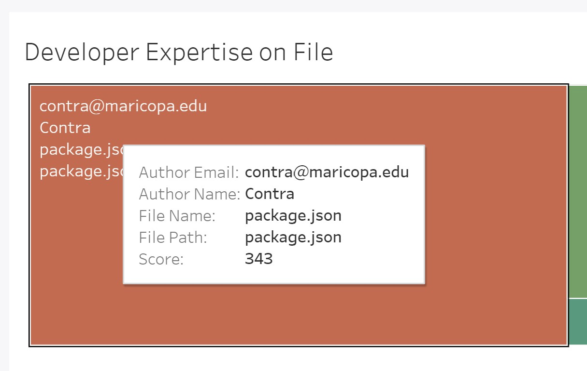

# Screencast: http://tiny.cc/CSC510_Demo

# Problem

Open Source Software (OSS) development is a production model that exploits the globally distributed intelligence of participants (developers) in Internet communities. The developers in this community hardly ever meet in a common platform. Most of OSS development follows agile development with lot of adhoc developments. Thus traceability & knowledge transfer is a major issue.

In OSS development projects any developer can contribute by adding new features or fixing existing issues. When some new developer tries to contribute to any part these projects or existing developers tries to contribute to some part of these projects which they are not familiar with They can face many issues. For example -

* They can have certain questions (i.e. how a method is supposed to work or why a part of code developed in a certain way) while updating a file or use an existing code from a file, but they are not sure who can answer these questions. The answers to these questions do lie in git history, but due to the large volume of it, it is almost impossible to search for a certain code. 

* Certain files in a codebase may have dependencies to other files. Without knowledge of those dependent files, when someone is trying to update the file, they might forget to update the dependent files. This might lead to a bug into the codebase.

* There are files in the majority of the projects, which are more bug prone than others. This may be due to unnecessary complexity of the code or other code smell factors. When updating these files, developers need to be more careful, or else that might introduce bugs into the codebase.

Our project tried to address issues outlined above by developing a web application. The web application analyzes GitHub repository and displays various insights of the repo to help headstart the developers. 

# Features
Primary features of the application are listed below. 

1. Landing page of the application. We have tried to make it visually appealing to make a good first impression. 

---

2. The landing page has two interactive elements. On the top right is a drop down menu with pre-mined repositories. It also has a search function for quick navigation. 

---

3. The second element is a call to action button to mine a new repository. A click on the button will open a pop-up box. User can enter URL of a new repository to analyze and the application will analyze it in real time. 

---

4. Main dashboard is shown below. This page can be reached by either mining a new repository or by selecting an already existing one. Individual features are explained further. 

---

5. The left pane is directory structure of the GitHub repository. It allows easy navigation between files of the repository. 

---

6. The top pane displays information for selected file. 

---

7. Middle pane is an embedded frame from Tableau Online. It displays information of 3 use cases: Developer Expertise on File, Possible File Dependency and File Bugginess. The visualizations are animated and interactive. The data comes from Tableau and is real time. The frame will update the data based on the selected file from left pane. 

---

8. Hovering on any element of Tableau frame brings a pop-up with more details about that element. Useful for closer inspection.

---

9. The first pane in the Tableau data frame is to get developer expertise on file. In the screenshot below, for the file `package.json`, top developers are listed out. The orange box with the largest area portrays that the author Contra is the expert developer for this file. 

---

10. Middle pane is to identify possible file dependency. For the screenshot below, it displays possible dependent files for `package.json` file. Higher the blue bubble, higher the dependency. For instance, `README.md` and `package.json` have been changed together 18 times so they are dependent. 

---

11. Last pane identifies file bugginess.  `package.json` file has the buggy commits percentage score of 0.20. That is, 2/10 times when the file is committed, it was a bug fix. Closer the score to 1.0, higher the bugginess probability. 

---

12. The application is hosted on Heroku platform. The data is stored in PostgreSQL backend on Heroku. This tech stack allows the application to be easily scalable. 

---

13. CI/CD pipeline is fully automated with the integration of GitHub and Heroku. Every push to `master` will deploy a new version of this app. Deploys happen automatically.

---

14. The data is stored PostgreSQL relational database. The tables are in 3NF format and can be easily extended/scaled without impacting existing functionality. 

# Reflection

This project was a great example for us to know how software development works in real world. This project had a great learning curve, which allowed us to use the skills learned during this period to apply when we start working in software industry. This project presented us with many challenges, and we learned and deployed different software engineering practices to overcome those. The lessons learned can be divided into few categories - 

### Requirment & Architectural Design

The first part of the project was to define existing problems in software development process and way to mitigate that. This was a great learning experience as this allowed us to understand what are the problems that developers face day to day, and how to define which are the problem worth solving. We learned to think from a developer's perspective as well as researcher's. Then came the Architectural Design part, we learned in class different types of architectural designs and that helped us to create a design which was divided into separate front end and back end. We employed a multi-layered architecture, where the front end layer was a web portal developed in AngularJS & D3.Js, a saperate back end layer developed in Flask application (built on Python), a database layer which is a PostgreSQL and data visualization layer using Tableau. Using this architecture allowed us to plug and play mock and real components as they were developed in phases.

### Project Setup and Planning

Another lesson learned from this project was to plan and mange development process. At start we had an overview of agile practices, but most of us was not experienced in practicing this in live projects. We adopted a canban board (GitHub project)
to create, assign and track tasks. At the start we did struggle with the size of the task, but soon we learned how long or granular tasks should be. We created a set of tasks (backlog) at the beginning of the 3 week sprints, by discussing among the teammates. This helped us to understand and assign the amount of work needed in that sprint from individual team members. We adopted a parallel development process, where each member of the team was assigned tasks based on expertise. Although this resulted in not able to learn all the technologies used in this project, but this greatly helped us completing tasks on time and implement better solution.

### GitHub mining tasks

The major hurdle for our project was to develop the logic for every use case of our project. We had 3 separate use cases, addressing 3 problems mentioned in the problem section. First we tried to use the GitHub API to mine the repositories, but as GitHub only allows 5000 API calls, we started reaching the limit very fast. So we decided to get the data using API calls is not a suitable option for us. We started researching how can we mine the data otherwise. We found out, all the information that is needed for our use case, resides on git log. We used the PyGit2 library for accessing the git log and mine the information. Using  PyGit2 was challenging at first, but we went through the documentation to learn how to clone the repository, how to walk through the git history to retrieve the commits and related details. We were able to collect all the data we needed for this analysis using local git logs. Also this method was an order of magnitude faster than using API calls. The detailed implementation in developing the features are specified [here](https://github.ncsu.edu/dpdodiya/csc510-project/blob/master/MILESTONE3.md).

### Tableau Analytics

In this project, our main goal was to show powerful analytics, which will in turn help developers work more efficiently. From the first part of the project, we had an idea about how data will look like, so we created mock data for all use cases for visualization part. We used Tableau tool to provide better visualizations and interpretations of the data. We had no experience of using Tableau before, so we struggled a bit at start, but soon was able to create meaningful and easily interpretative visualization. As all the layers were developed in a modular way, it was easy for us to change the visualization and data sources on the go, and reflecting it without any code changes in the application. Although we feel  more powerful & intuitive visualizations for our data can be created using Tableau.

### Flask Application and PostgreSQL database

Since, we are using PyGit2 library for the mining repositories, creating a flask application was relevant in order to create a better UI and control for user experience. The flask application also needed to be connected with the database in order to store the relevant information generated specific to that repository. At first we started with separately running the Flask application to mine the data, then store it in raw format in a temporary location to be ingested into the database, but later we felt this was an unnecessary overhead to the system, then we changed the architecture to directly send the data to the database server to be ingested and stored. This in turn improved the performance and memory requirement of the system. This also give us a learning experience of how to separate development and production environment, as we used a local PostgreSQL client for development purpose and migrated that instance for production when changes are done. We also integrated the tableau dashboard with the flask app to provide better user interaction.

### Docker and Deployment

We chose Heroku to deploy our codebase. Heroku is a Platform as a Service (PaaS) for managing applications on the cloud. Heroku also provides add-on features such as PostgreSQL clients to satisfy our needs. Deploying our code base to Heroku directly using GitHub remote introduced certain problems related to dependent libraries used in the project. To resolve this issue, we used Docker container along with our custom image (with all installed dependencies) and used a Continuous Integration/ Continuous Deployment approach for rebuilding the container for any code modifications to reflect on the deployed version. This gave us an idea about how CI-CD pipelines work and how a development process can benefit form using that. 

### Team Effort

For successful implementation of a project, availability and usages of tools are an important factor, but so is the team effort. People in the team are the main driving force of any software projects, they are the one analyzing tools, developing solutions and coming up with innovative ideas. This is one of the main take away from this project. Although the team was formed randomly and no one knew about the other persons before the team was formed, all of the teammates came together, discussed their ideas, put forth their expertise and actively participated by taking on responsibility as needed. It was evident from the experience that, a project is successful because the people who are developing are putting their effort in making it successful.

In a nutshell, the lessons learned from the Software Engineering class, following the agile principle to manage and assign task throughout the projects and efforts put in by individual team member was vital towards the successful completion of this project.

# Limitations

Although the project was successfully implemented and deployed, every project has its limitation. In our project the limitation that we feel can be improved further are - 

### The technical limitation: 
* The main functionality of our project is provided by Tableau. To provide all the insights regarding the data in a re presentable format and easy to understand is what Tableau is known for. We used Tableau Online for hosting our data source online and to reflect changes to the dashboard. The edition of the software which we are using is not accustomed to deliver real-time updates from the data source to the dashboard. For an updated dashboard, we need a premium edition of Tableau and without paying the required fees, we are at the mercy of a single refresh button to reflect our changes in the database to the dashboard.

* The PostgreSQL server, that we have used for storing the data and showing the visualizations in Tableau is also a free version. This allows us to only store 10000 rows at a single instance. Our use cases sometimes create more than 10000 rows even for a single repository. Because of this limitation we have not been able to run our analysis on large repositories and store the data.  

* Currently there's no easy way to delete an already analyzed repository. 

* Support for repositories hosted on GitHub Enterprise is not available. 

### Research limitations:
* For the 1st use case, we used a scoring mechanism to represent the developer's expertise on a file. This scoring mechanism was done by normalizing lines of code added by developer multiplied by a time normalization factor. We came up with the scoring mechanism by yourself. This scoring mechanism need to be evaluated. 

# Future Work

At the moment, the features provided by our application is to view analytics over the repository as a whole and a single file level. We did think of certain updates in the near future for this project which are listed as follows:

* Evaluation of the scoring mechanism by conducting empirical study. This can be achieved by asking our suggested developer     their actual understanding of the files. 
* Provide all the functionalities at multi-file level  
  &nbsp;  Users can choose multiple files for studying their behavior with respect to the whole repositories.
* Full Tableau Access  
  &nbsp; Real-time updation of dashboard at production level to maximize functionality
* Advanced analytic capabilities  
  &nbsp; Offer more advanced analysis such as mining issues to tell where to look at for resolving them, study of commit messages to offer more insights over the timeline of the repository etc.

* Compare metrics of multiple files at the same time as opposed to current metric of one file at a time. 
